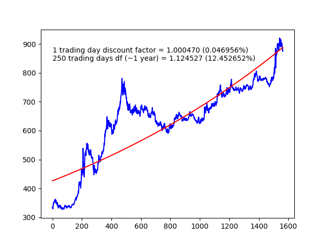

exponential regression for quotas.
quotas could be taken from 2 formats: 
-1 csv.
-2 some custom format 

example call:
./quotas-approx.py --type CSV --quotas-fname ./example-quotas/FXRU_ETF.txt

the result of execution:

so its may be better to buy fxru (rub -> fxru) at the moment (price under exponential line).

I think better apply this script to instruments that have exponential nature:
USDRUB, FXRU (eurobonds etf / rub) etc

had have to done it because of tradingview.com has pure programming functionality
